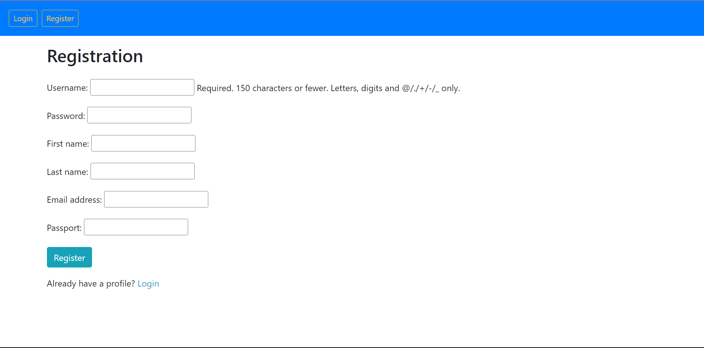
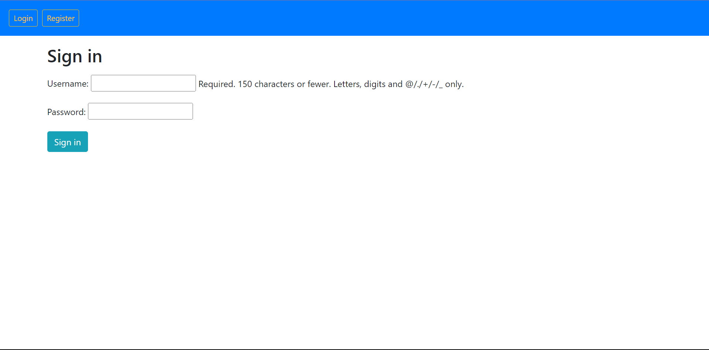
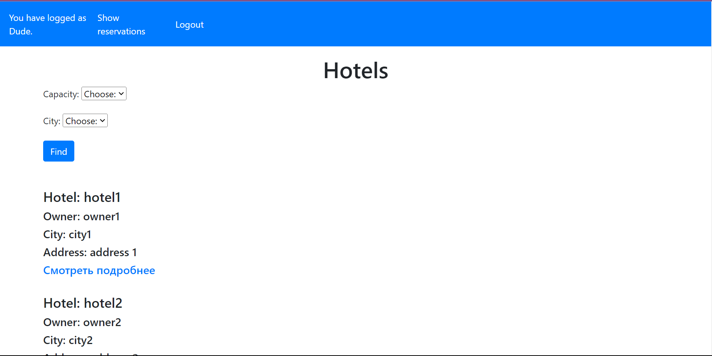
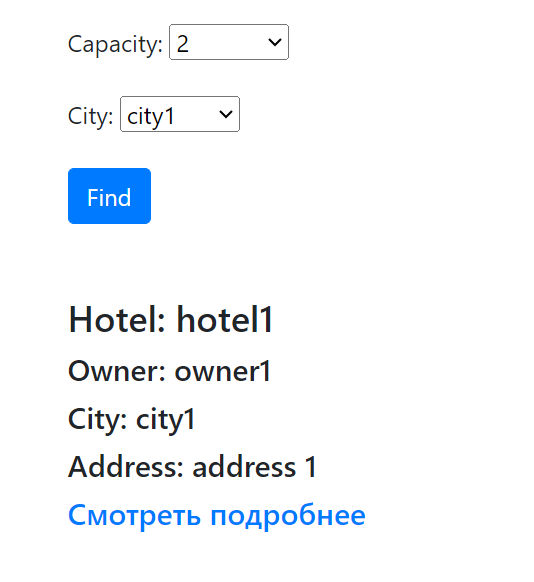
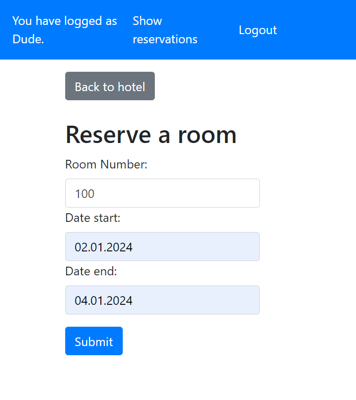
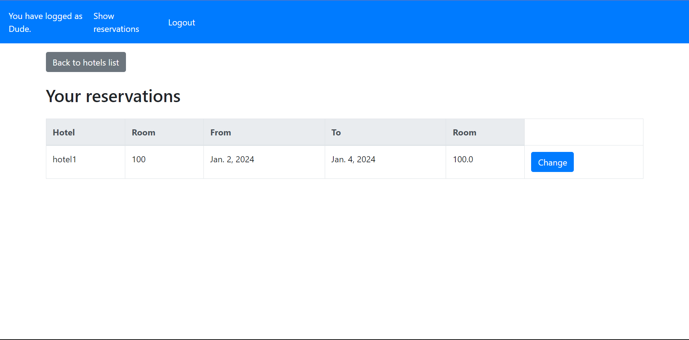
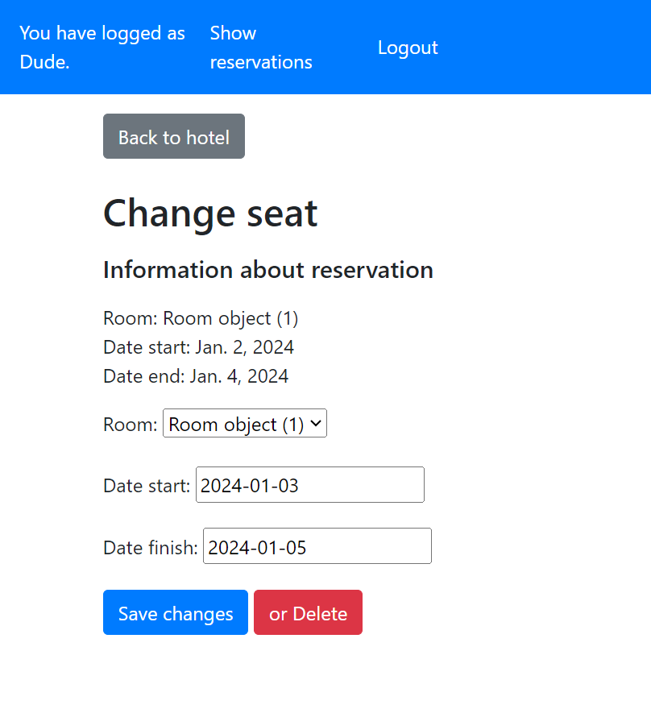
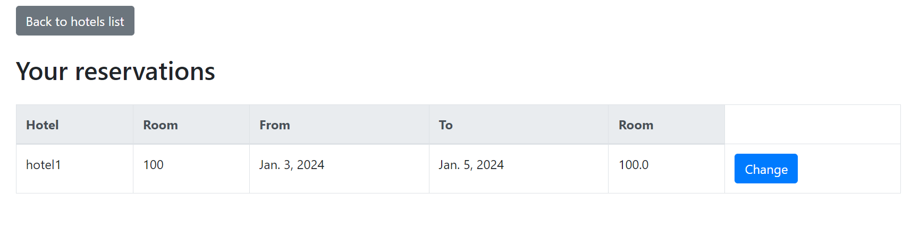
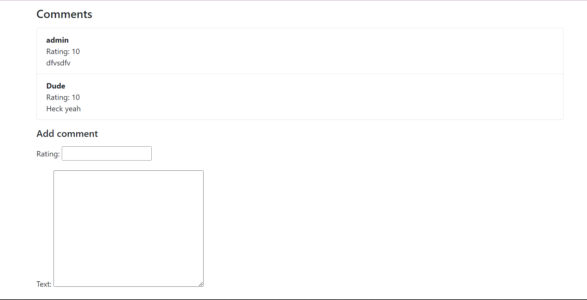
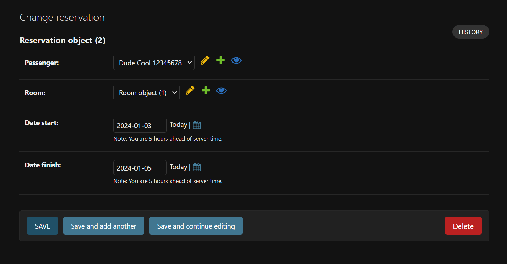

#Lab 2

## Let's take a look at the functionality first:

### First we have to register

### Now we log in

### Welcome to the main page!

### Here we can use filters to look for specific hotels

### Let's make a reservation

### Now procced to the reservation list

### Here we can change reservation info. Let's do just that

### You can see the dates changed

### Now that we our reservation due date is over we an leave a comment:

### From admin page we can change and delete reservations

## Now you can review the code!
For example see the models [code](models.md) for further inspection of the project.