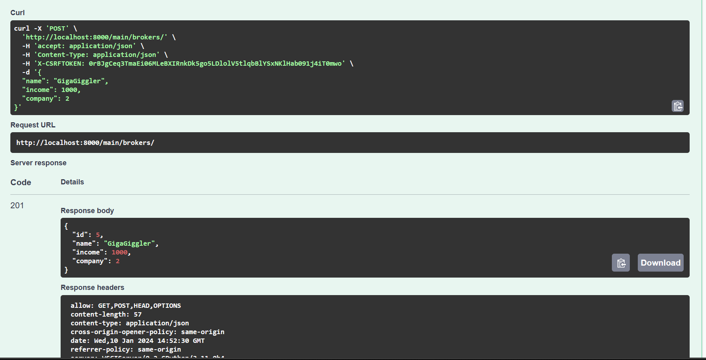
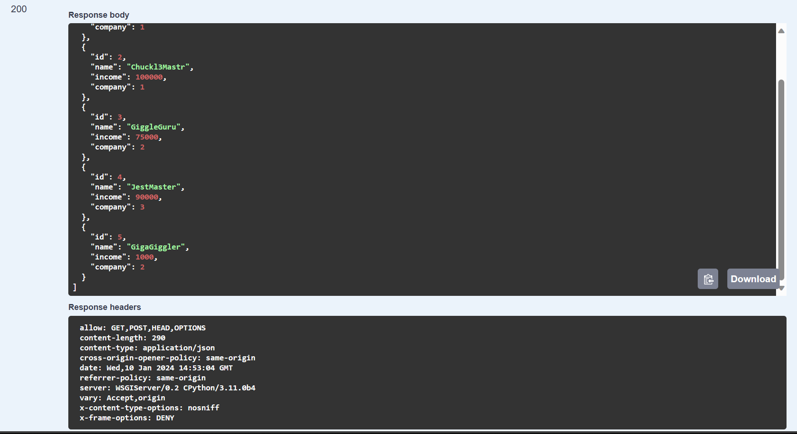

# Lab 3

## Here's a DB diagram to understand relations better

## Let's start a server and proceed to a Swagger API
Here we can see all the queries that are created by our ViewSets

## Let's check the GET request

## Then POST

now we're checking via GET whether new data has been added

## Finally, let's check PATCH

Now I suggest you review the full [code](models.md)