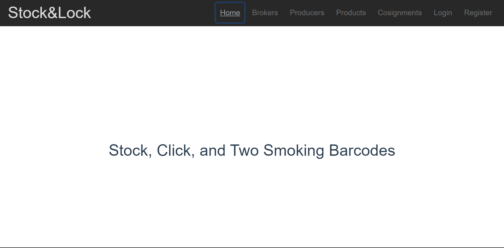
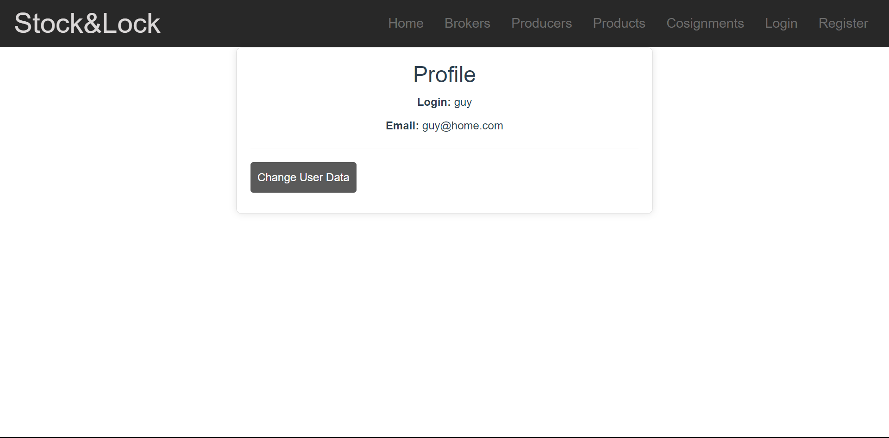
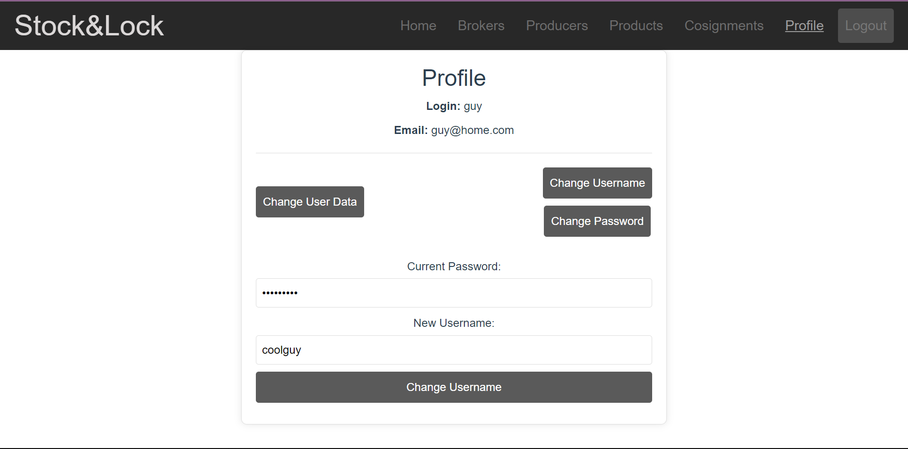
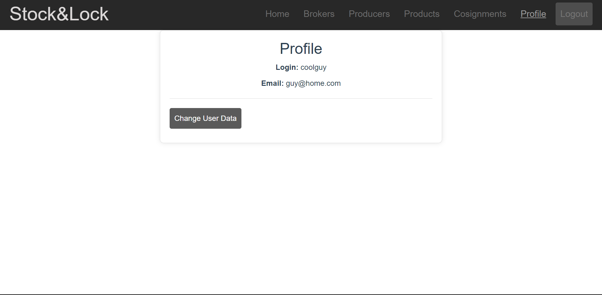
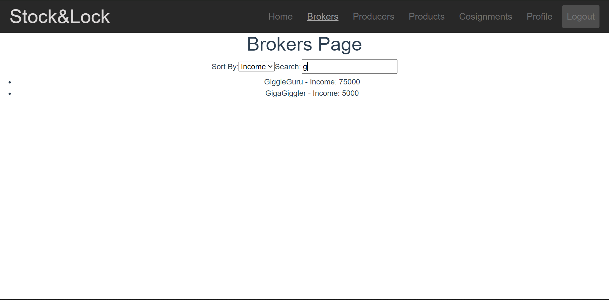
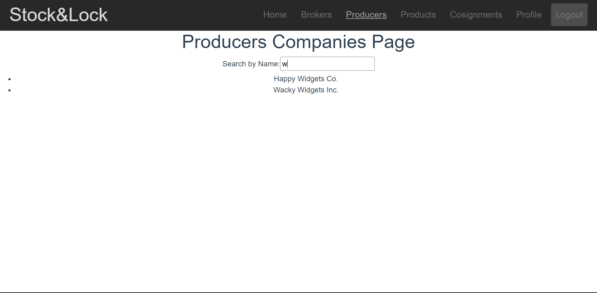
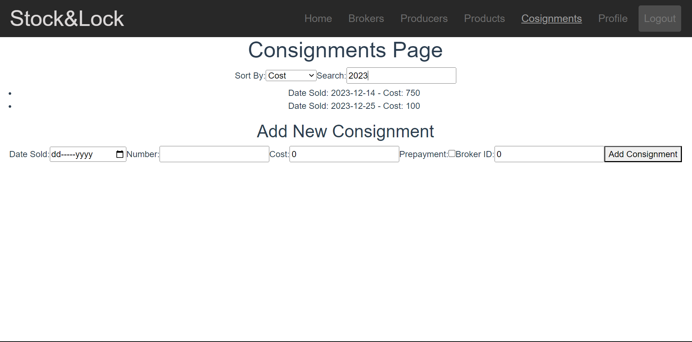
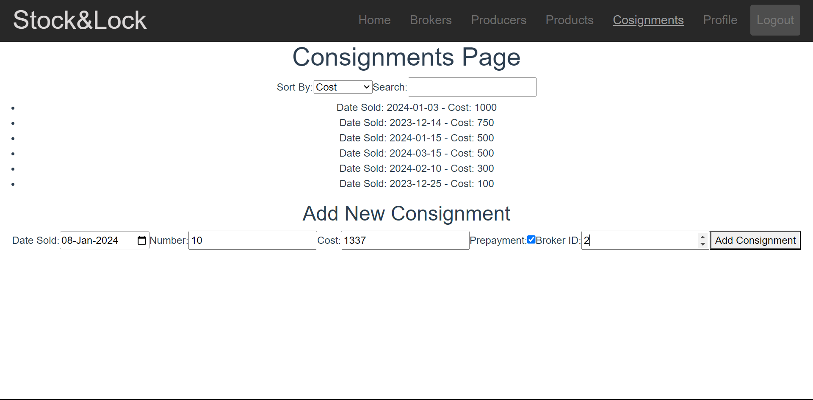

# Lab 4

## In this project we use database from [Lab 3](../Lab3/overview.md)

## Let's take a look at our website:
Firstly, we get to the Home page, but if we try to navigate somewhere else, we will be redirected to the Login page, since we are not logged in

## Let's create an account

## After logging in we will be redirected to the Profile page

## Here we can change the info if needed

## Let's navigate to the brokers page

Here we can filter available brokers by income or name and search by name

## Proceed to the producers page

We can search producer companies by name

## Moving on to the products page

Here we can filter our products by code, shelf life and weight, we can also search products by name

## Finally, consignment page

As we can see, it joins company, product and brokers together
We can also filter by cost of the consignment or date and search by date

## Let's create new cosignment directly on this page

New consignment has been created!

## Now proceed to review the [code](mainjs.md)!